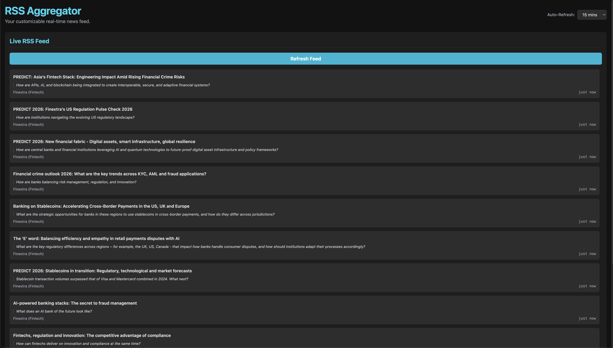

# RSS Aggregator

A simple and clean RSS feed aggregator built with React and Vite. It allows you to view articles from your favorite RSS feeds in a clean, paginated interface.



## Features

- **Fetches and displays articles:** Aggregates articles from a predefined list of RSS feeds.
- **Pagination:** Easily navigate through a large number of articles.
- **Feed Manager:** Enable or disable specific feeds to customize your news sources.
- **Auto-Refresh:** Automatically fetches new articles at a configurable interval.
- **Responsive Design:** Clean and modern interface that works on different screen sizes.

## Tech Stack

- **[React](https://reactjs.org/):** A JavaScript library for building user interfaces.
- **[Vite](https://vitejs.dev/):** A fast build tool and development server for modern web projects.
- **[TypeScript](https://www.typescriptlang.org/):** A typed superset of JavaScript that compiles to plain JavaScript.
- **[Tailwind CSS](https://tailwindcss.com/):** A utility-first CSS framework for rapid UI development.

## Local Development

**Prerequisites:** [Node.js](https://nodejs.org/) (v20.11.0 or higher recommended)

1.  **Clone the repository:**
    ```bash
    git clone https://github.com/<USERNAME>/rss-aggregator.git
    cd rss-aggregator
    ```

2.  **Install dependencies:**
    ```bash
    npm install
    ```

3.  **Run the development server:**
    ```bash
    npm run dev
    ```
    The application will be available at `http://localhost:3000`.

## Deployment to GitHub Pages

This project is set up for easy deployment to GitHub Pages.

1.  **Update `package.json`:**
    Open the `package.json` file and replace `<USERNAME>` in the `homepage` property with your GitHub username:
    ```json
    "homepage": "https://<USERNAME>.github.io/rss-aggregator",
    ```

2.  **Commit and push your changes:**
    ```bash
    git add .
    git commit -m "Configure for GitHub Pages"
    git push
    ```

3.  **Deploy the application:**
    Run the following command to build and deploy your application to the `gh-pages` branch:
    ```bash
    npm run deploy
    ```

4.  **Configure GitHub Pages in your repository:**
    - Go to your repository's settings on GitHub.
    - In the "Pages" section, select the `gh-pages` branch as the source.
    - Save the changes.

Your application will be live at the URL specified in the `homepage` property of your `package.json` file.
